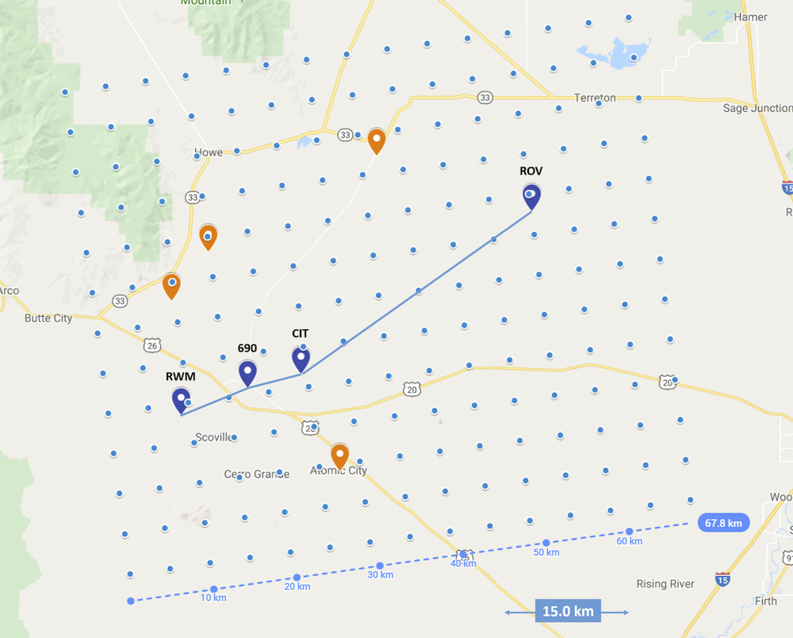

# Ampacity Prediction Benchmark Idaho

This dataset is a benchmark intended for ampacity forecasting. The dataset was compiled by Nicholas Popovic and Gabriela Molinar as part of the Prognonetz Project
at Karlsruhe Institute of Technology. The raw data was obtained through the National Oceanic and Atmospheric Administration (NOAA) web services.

## Data Description

### Available Locations

Name|ID|Latitude|Longitude|Elevation (ft)
| :-------------    | :----------:  | -----------:  | -----------: | -----------: |
CFA Building 690|690|43.532598|112.947757|4950
Critical Infrastructure Complex|CIT|43.547483|112.869683|4910
Rover|ROV|43.72059|112.52956|5008
Radioactive Waste Management|RWM|43.503433|113.046033|5025

### Available Observational Features

| Identifier       | Description     | Data Source     |
| :-------------    | :----------:  | -----------: |
|  temperature_15m |  Ambient temperature at 15m above ground [°C]  |   \[1\]  |
|  wind_speed | wind speed [m/s]   |   \[1\]  |
|  wind_direction |  wind direction [°]  |  \[1\]   |
|  solar_radiation |  solar radiation [W/m^2]  |   \[1\]  |
|  pressure |  barometric pressure [inHG]  |  \[1\]   |
|  humidity |  relative humidity [%]  |  \[1\]   |
|  pressure_gradient_c1 |  principal component 1 of pressure gradient  |  \[3\]  |
|  pressure_gradient_c2 |  principal component 2 of pressure gradient  |   \[3\] |

### Available Forecast Features (NWP)

For each grid point there are 3 weather variables.

| Identifier       | Description     | Data Source     |
| :-------------    | :----------:  | -----------: |
|  TMP |  Ambient temperature [°C]  |   \[2\]  |
|  WSPD | wind speed [m/s]   |   \[2\]  |
|  WDIR |  wind direction [°]  |  \[2\]   |

### Available Ampacities (Labels)

| From Station | To Station | bearing [°] | Identifier |
| :-------------    | :----------:  | -----------: | -----------: |
| RWM | 690 | 67.7097 | RWM_690 |
| 690 | RWM | 247.7772 | 690_RWM |
| 690 | CIT | 75.2375 | 690_CIT |
| CIT | 690 | 255.2914 | CIT_690 |
| CIT | ROV | 54.7675 | CIT_ROV |
| ROV | CIT | 235.0022 | ROV_CIT |

### Data sources

Raw data was sourced from:



#### [\[1\] NOAA INL weather center](https://www.noaa.inl.gov/extract/)

While the INL mesonet includes 35 weather stations, four weather stations were selected for this project. The stations were chosen so that they would form plausible geographical arrangements that could model the paths of a power line.

#### [\[2\] CONUS NWP data](https://www.ncdc.noaa.gov/data-access/model-data/model-datasets/numerical-weather-prediction)

The CONtinental US model (CONUS) covers the INL Mesonet region. Its spatial resolution is 5 km (CONUS 5) until September 2014. Afterwards, the model was updated to CONUS 2.5, offering a higher resolution of 2.5 km. In order to maintain homogeneity over the whole study, while having enough data to obtain statistically meaningful results, the dataset was restricted to CONUS 5, from 2009 to 2014. The above figure shows the coverage of this NWP model over the overhead line case study of this paper.

#### [\[3\] NCDC remote stations](https://www.ncdc.noaa.gov)


The weather stations of the INL Mesonet state an accuracy of ± 0.55 mbar for their barometric pressure measurements. Typical magnitudes for horizontal pressure changes are around 1mbar per 100km. With the individual stations being located as close as approx. 10km from each other, this accuracy is not sufficient for reliably calculating the pressure gradient, and therefore the geostrophic wind approximation. Therefore, a second set of weather stations was needed to increase the spatial coverage of pressure measurements. Since the selection of the off-site stations depended on the location of the selected on-site stations, it follows, that the stations selected for calculating the atmospheric pressure gradient are all located around the INL. In total, 14 weather stations were chosen, the most remote of them being approx. 950 km from the INL site. This data was obtained through the NOAAs National Climatic Data Centres (NCDC). These datasets include pre-calculated sea level pressure estimates.

## Usage

The data is organized into two separate .npz files containing the train and test datasets, respectively.

The .npz files can be loaded using numpy and are structured as follows.

| Key | Description |
| :-------------    | -----------: |
| ft_obs | Tensor of shape (16787, 48, 32) containing past 48 hours of observational data |
| ft_obs_index | List of shape (32,) containing index for ft_obs tensor. Entries are formatted like so: 'stationID_variableID' example: 'RWM_pressure' |
| ft_nwp | Tensor of shape (16787, 48, 16, 14, 3) containing next 48 hours of NWP data |
| ft_nwp_index | List of shape (3,) containing index for ft_nwp tensor.|
| nwp_grid | Tensor of shape (16, 14, 2) containing grid coordinates for NWP Data |
| lb | Tensor of shape (16787, 48, 6) containing next 48 hours of ampacities (labels) |
| lb_index | List of shape (32,) containing index for lb tensor. Entries are formatted like so: 'stationID_stationID' example: 'RWM_690' |
| ts | Tensor of shape (16787, 48, 2) containing timestamps for all samples |

Loading example:
```python
import numpy as np

# past 48 hours of observational data
# shape: (16787, 48, 32)
ft_obs = np.load('data/Prognonetz_INL_train_small.npz')['ft_obs']
```

## Example (Pytorch)

In order to simplify usage, this repository includes sample implementations of datasets for use with Pytorch. See usage.py for example use cases.

## Download

| File                                                                                                        |      Size     |                           md5sum |
|-------------------------------------------------------------------------------------------------------------|:-------------:|---------------------------------:|
| [Full Dataset](https://www.dropbox.com/s/qwjtwfzl4ei2i05/prognonetz_dataset.tar.gz?dl=1)                    |     266 MB    | b92b75a20e9e6d9890caa48defae6868 |
| [Small Dataset for testing](https://www.dropbox.com/s/gk72osjlcjg14fh/prognonetz_dataset_small.tar.gz?dl=1) |     12 MB     | c4d4e5e91e6c9718a762bac8b496e44e |

## Reference

In this [details will follow] article we present the dataset. Please cite it if you intend to use this dataset.
